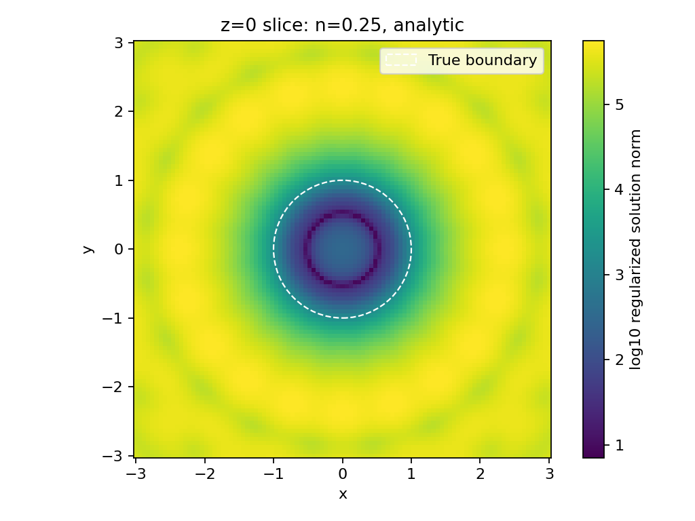
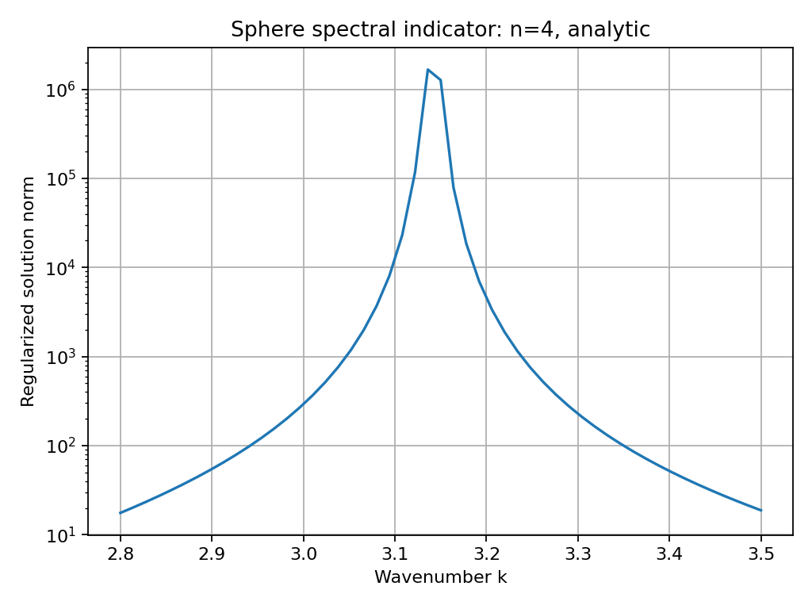

# Inverse Scattering

**Reconstruction of a constant acoustic refractive coefficient from interior
transmission eigenvalues, with linear sampling examples for disks and spheres.**

This research repository contains MATLAB/Octave Galerkin solvers, analytical
forward-scattering benchmarks, and Python/optional FEM-BEM examples recovered
and cleaned from the project archive. The accompanying
[presentation](Presentation_rv2.pdf) explains the original work.

## What you can run

| Workflow | Entry point | Requirements |
| --- | --- | --- |
| Reconstruct a constant coefficient on a unit disk | `Codes/2D/main.m` | MATLAB or GNU Octave |
| Reconstruct a constant coefficient on a unit ball | `Codes/3D/main_3D.m` | MATLAB or GNU Octave |
| Plot determinants and bracket individual transmission roots | `Codes/2D/*det*.m`, `Codes/3D/*det*.m` | MATLAB or GNU Octave |
| Disk spectral indicator and shape reconstruction | `Codes/2D/LSM/` | MATLAB/Octave; optional μ-diff for multiple disks |
| Sphere spectral indicator and shape reconstruction | `Codes/Python/LSM_*.py` | Python, NumPy, SciPy, Matplotlib |
| Sphere total field and numerical far field | `Codes/Python/FEM_BEM_Helmholtz_sphere.py` | Optional legacy DOLFIN/Bempp environment |

The default examples use synthetic data for homogeneous disks/balls. The
analytical Python backend runs without FEniCS, Bempp, meshio, or pygalmesh.

## Mathematical convention

Throughout the cleaned code, **`n` is the coefficient in the wave equation**,
$n=c_0^2/c^2$, so the interior wavenumber is $k\sqrt{n}$. Do not pass
$\sqrt{n}$ as `n`. The transmission problem is

$$
\Delta w+k^2nw=0,\qquad \Delta v+k^2v=0\quad\text{in }D,
$$

with $w=v$ and $\partial_\nu w=\partial_\nu v$ on $\partial D$.
The Galerkin method uses clamped disk/ball basis functions and solves

$$
(A+\lambda B+\lambda^2C)c=0,\qquad \lambda=k^2.
$$

For real, constant `n`, the implemented matrices are
$A=S$, $B=nG+G^T$, $C=nM$, where
$S_{ij}=\langle\Delta\phi_i,\Delta\phi_j\rangle$,
$G_{ij}=\langle\Delta\phi_i,\phi_j\rangle$, and
$M_{ij}=\langle\phi_i,\phi_j\rangle$.
This multiplies the original weak form by the common factor $n-1$.
The case `n=1` has no contrast and is excluded from the eigenvalue solver.

## Quick start: MATLAB or Octave

Clone the repository, then run from its root:

```matlab
run('Codes/2D/main.m');       % example: reference n=3, N=20
run('Codes/3D/main_3D.m');    % example: reference n=40, N=8
```

Both examples print the best candidate `n` and save a `.mat` result and `.png`
plot under `outputs/`. The defaults recover **3** and **40**, respectively.
The core solver requires neither Symbolic Math Toolbox nor Parallel Computing
Toolbox. Optional `basis_functions*.m` and `A*_function*.m` reference routines
require MATLAB's Symbolic Math Toolbox.

For a custom scan:

```matlab
addpath('Codes/common');
result = ite_sweep(3,20,30:0.25:50,0.716709033375646);
disp(result.estimated_n);
```

The arguments are dimension, basis size, candidate coefficients, and reference
wavenumber. Basis sizes **1–20** are supported. Increasing `N` changes the
approximation; a dense candidate grid does not compensate for a small basis.

Disk linear sampling examples:

```matlab
addpath('Codes/2D/LSM');
spectrum = lsm_eigenvalues(10);
shape = lsm_shape(4,2*pi);
```

For the optional multiple-disk backend, install
[μ-diff](https://github.com/mu-diff/mu-diff) separately and add its directories:

```matlab
addpath(genpath('/path/to/mu-diff'));
shape = lsm_shape(4,2,'mu-diff',[-1.5 1.5;0 0],[0.5 0.5]);
```

The two dimension folders contain a function named `f.m`; add the dimension
you are working on, rather than adding all of `Codes` recursively.

## Quick start: Python

Python 3.11 or newer is recommended. From the repository root:

```bash
python -m venv .venv
# Linux/macOS:
source .venv/bin/activate
# Windows PowerShell: .venv\Scripts\Activate.ps1
python -m pip install -r requirements.txt

python Codes/Python/Spherical_domain_det_root.py
python Codes/Python/LSM_EigenValue.py
python Codes/Python/LSM_Penetrable.py --n-theta 10 --n-phi 20
```

The root example returns approximately `0.716709033375646` for `n=40` and
spherical harmonic order zero. The LSM commands write data (`.npz`) and plots
(`.png`) under `outputs/`. Use `--help` for parameters, `--output-dir` to select
a destination, or `--show` to display the LSM figures interactively.



*Recomputed example: unit sphere, `n=0.25`, `k=6`, 10×20 angular directions,
101×101 sampling points in the `z=0` plane. Lower values of the plotted
logarithmic solution norm indicate the interior; the dashed curve is the
known boundary. This is an indicator, not an automatically segmented surface.*



*Recomputed example: `n=4`, `k=2.8…3.5`, 51 samples, regularization `1e-6`.
Regularization and sampling affect peak locations and heights.*

### Optional FEM-BEM backend

The archived workflow uses **legacy FEniCS/DOLFIN**, not FEniCSx. A Linux
environment specification is provided:

```bash
conda env create -f environment-fem.yml
conda activate inverse-scattering-fem
python tests/check_fem_bem.py
python Codes/Python/FEM_BEM_Helmholtz_sphere.py --k 1 --n 2.25 --mesh-size 0.2
```

Select `--backend fem-bem` on either Python LSM command to use the numerical
forward solver. This can be substantially slower because every incident wave
requires a linear solve. Operators are reused for a fixed wavenumber. See
[validation and limitations](docs/VALIDATION.md) before interpreting results.

## Tests and reproducibility

```bash
python -m unittest discover -s tests -v
octave-cli --quiet --eval "addpath('tests'); run_matlab_tests"
```

In MATLAB, run `addpath('tests'); run_matlab_tests`.
Optional dependency checks:

```matlab
addpath('tests');
check_mu_diff('/path/to/mu-diff');
```

The core suite checks complex regularization, quadrature, analytic scattering
identities, roots, reconstruction sweeps, Galerkin convergence, and command-line
outputs. The optional FEM-BEM check compares far fields and total fields against
an independent partial-wave solution. GitHub Actions is configured for the
core checks; the workflow will run after the package is pushed.

See [VALIDATION.md](docs/VALIDATION.md) for measured errors, tested versions,
and checks that could not be performed. MATLAB itself and its optional symbolic
reference routines have not been executed in the validation environment;
the numerical `.m` workflows were executed with GNU Octave.

## Scope and remaining limitations

- Galerkin reconstruction assumes a real, positive, **constant** coefficient on
  a unit disk or ball. It does not reconstruct a spatially varying material or
  an arbitrary boundary.
- The finite basis contains one angular representative per included order.
  Rotational degeneracies are omitted; this is sufficient for the corresponding
  homogeneous disk/ball eigenvalue branches, not a general three-dimensional basis.
- The first positive root of an individual order is not necessarily the first
  transmission eigenvalue across all orders. Bracketed root scripts report
  their selected order explicitly.
- LSM examples use synthetic full-aperture data and fixed Tikhonov parameters.
  Noise estimation, automatic parameter selection, limited-aperture recovery,
  and automatic eigenvalue extraction remain future work. A center-point RHS
  primarily probes the radial branch; it does not reveal every angular mode.
- FEM/BEM results require mesh, quadrature, and solver convergence studies for
  each regime. The supplied check is a low-frequency sphere benchmark. Boundary
  sample points in the near-field plot are masked; interior interpolation near
  the curved boundary uses the approximate tetrahedral mesh.
- Matching one eigenvalue on a candidate grid is a demonstration, not a proof
  of uniqueness of the recovered coefficient.

## Project material

- [Original presentation](Presentation_rv2.pdf), 41 slides, March 2024.
- [Historical figures](docs/HISTORICAL_RESULTS.md) retained from the original README.
- [Changes and numerical corrections](docs/CHANGES.md).
- [Archive source map](docs/SOURCE_MANIFEST.md).
- [Validation report](docs/VALIDATION.md).
- [Applying the prepared package](docs/PUSH_GUIDE.md).

Related literature: Pallikarakis' 2017 thesis on the inverse spectral problem
for the refractive index; Cakoni, Colton and Monk (2007),
[Inverse Problems 23, 507](https://doi.org/10.1088/0266-5611/23/2/004);
Leung and Colton (2012),
[Complex transmission eigenvalues for spherically stratified media](https://doi.org/10.1088/0266-5611/28/7/075005).

## License and contact

The project [MIT license](LICENSE) is preserved. The μ-diff-derived examples
retain GPL-3.0-or-later terms, and third-party notices are collected in
[THIRD_PARTY_NOTICES.md](THIRD_PARTY_NOTICES.md).

Hassan Yazdanian — <hassanyazdanian@gmail.com>
