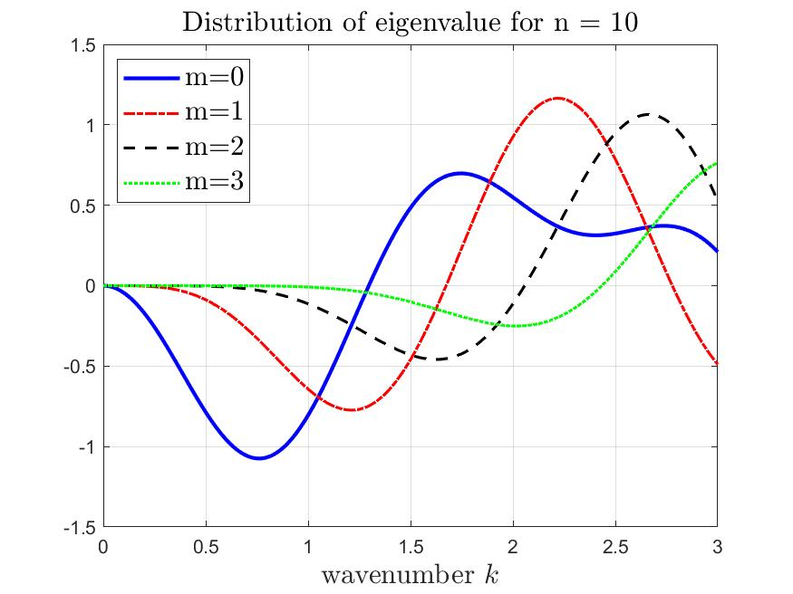
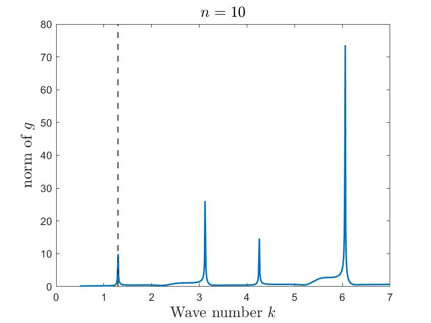
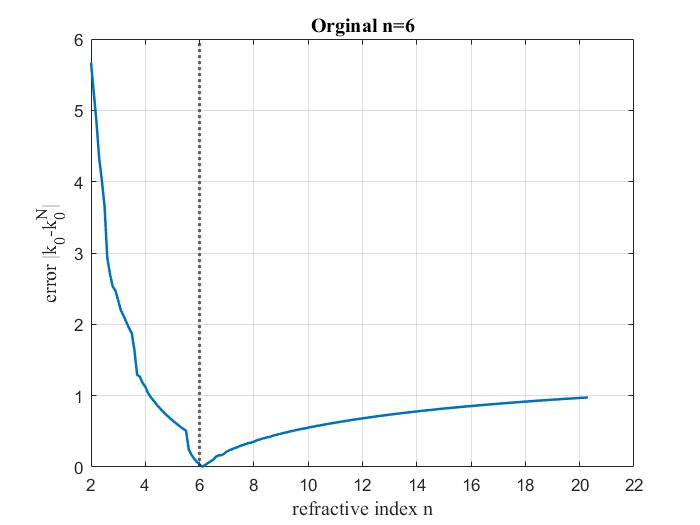
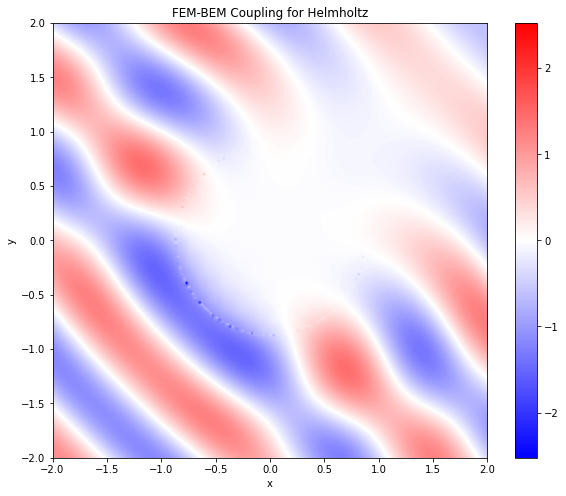
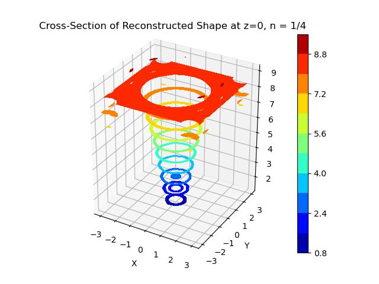

# Historical project figures

These are the five figures from the original repository README. They are kept
as project context, with local image links. They were not regenerated by the
cleaned code; numerical corrections, parameter conventions, and regularization
can change the results. See [CHANGES.md](CHANGES.md).

## Disk characteristic function, n=10

## Disk far-field spectral indicator, n=10

## Refractive-index reconstruction, reference n=6

## Sphere near field

## Sphere shape indicator

The old Python files contained inconsistent `n` versus `n^2` comments. This
historical image is therefore not used as evidence that the corrected `n=0.25`
example reproduces exactly the same calculation.
